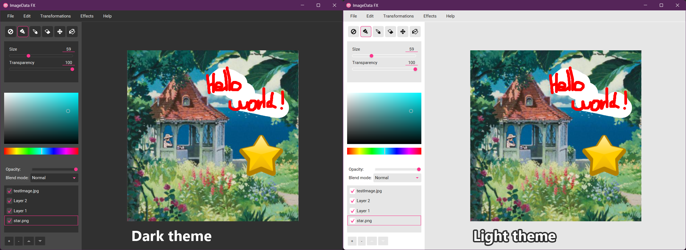
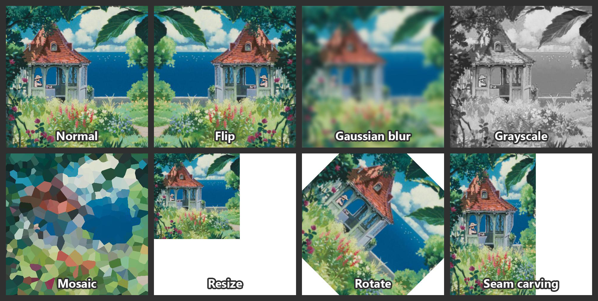

# IDFX - An image processing software written in Java

## What is IDFX?

### The project

IDFX is an image processing software. It's written in Java, with a GUI based on JavaFX. It was originally a team project for our Software Engineering course.

### The team

The team is composed of 3 engineering students studying computer science. The current repository is a reupload of the files.

## What can I do with IDFX?

### Features

- A **custom format** to save and load your projects
- **Layers** with multiple **blend modes** and **opacity** control
- Multiple **export formats**
- An **undo and redo system**
- A **light and dark theme**

### Tools

- A **painting tool**, with adjustable size and opacity
- A **color picker tool**, to copy a color in the drawing area
- A **color picker widget**, to choose any color you would want
- A **bucket fill tool**, with adjustable opacity and tolerance to fill pixel regions
- A **move tool**, to adjust the positions of layers between one another
- An **eraser tool**, with adjustable size, to erase mistakes

### Effects and transformations

- A **gaussian blur**, with adjustable radius
- A **mosaic effect** (based on the Voronoi diagram)
- A **grayscale effect**
- A **seam carving effect** (content-aware resizing)
- The **rotation** of a layer
- The **translation** of a layer
- The **resizing** of a layer
- The **flip** of a layer

## Sources

- JavaFX documentation and tutorials
- [Stackoverflow](https://stackoverflow.com/questions/27171885/display-custom-color-dialog-directly-javafx-colorpicker)
- [Graphical assets](https://kenney.nl/assets/cursor-pack)
- [existing flood fill algorithm](https://en.wikipedia.org/wiki/Flood_fill#Span_filling)
- [Centered, Forward and Backward difference approximation of derivatives](https://www.dam.brown.edu/people/alcyew/handouts/numdiff.pdf)
- [Seam Carving Algorithm](https://graphics.cs.cmu.edu/courses/15-463/2012_fall/hw/proj3-seamcarving/imret.pdf)

